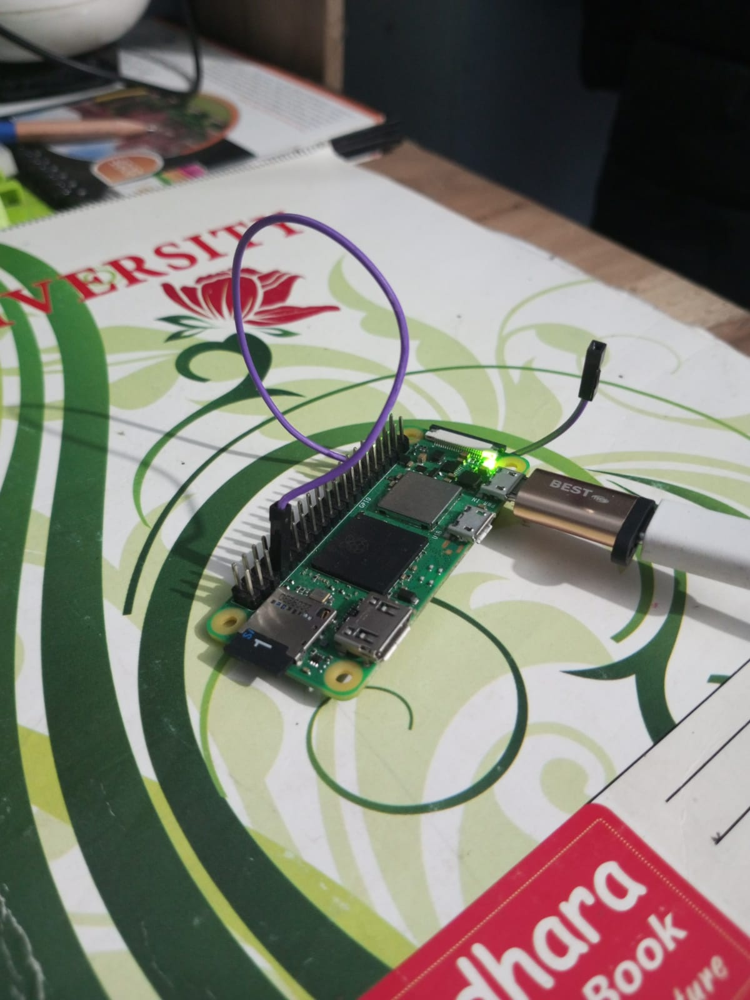
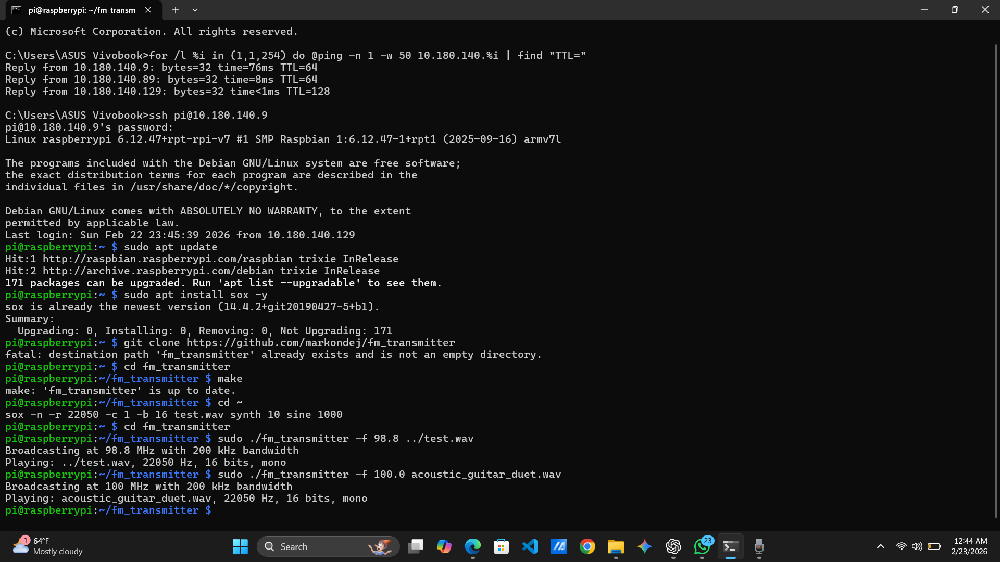

# Raspberry Pi FM Transmitter

## Project Overview
This project demonstrates how a Raspberry Pi can transmit an FM signal using its GPIO pin.

## Hardware
- Raspberry Pi Zero 2 W
- 5V / 2A Micro-USB Power Adapter
- Wire antenna (connected to GPIO pin 4)
- MicroSD card with Raspberry Pi OS
- FM radio receiver for signal testing
- ## Hardware Setup

## Software
- Raspberry Pi OS
- fm_transmitter
- SoX (Sound eXchange)

## Setup Steps

sudo apt update  
sudo apt install sox  

git clone https://github.com/markondej/fm_transmitter  
cd fm_transmitter  
make  

## Generate Test Wave

sox -n -r 22050 -c 1 -b 16 test.wav synth 10 sine 1000

This command generates a 10-second sine wave audio file for testing.

## Running the FM Transmitter

sudo ./fm_transmitter -f 100.0 test.wav

or transmitting another audio file:

sudo ./fm_transmitter -f 100.0 acoustic_guitar_duet.wav

## Result

The Raspberry Pi successfully transmitted an FM signal at **100 MHz** with **200 kHz bandwidth**.

## Terminal Output

## How It Works

The Raspberry Pi generates an FM signal by rapidly toggling GPIO pin 4.
This creates a carrier frequency that can be received by nearby FM radios.

The fm_transmitter program modulates the carrier frequency using the audio
signal from a WAV file, allowing the Raspberry Pi to broadcast audio.

## Notes

- The transmission range is very short (a few meters).
- A simple wire connected to GPIO 4 acts as an antenna.
- This project is intended for educational and experimental purposes only.

## Experiment

The transmission was tested using a nearby FM radio tuned to 100 MHz.
The signal could be received within approximately 2–3 meters using a
short wire antenna connected to GPIO 4.
